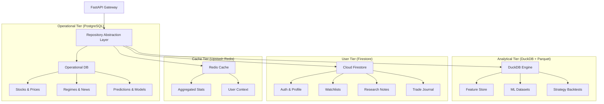

# NEW DATABASE ARCHITECTURE (RC-4 Hybrid)

## 🏗️ Hybrid Topology

## 📊 Data Mapping Summary

| Technology | Purpose | Primary Data Types |
| :--- | :--- | :--- |
| **PostgreSQL** | Operational / Relational | Market Metadata, Tickers, Live Predictions, Audit Logs. |
| **DuckDB** | Analytical / Batch | Feature Vectors, Historical OHLC (Analytical), Training Buffers. |
| **Firestore** | User / Real-time | Profiles, Watchlists, Research Notes, Terminal Layouts. |
| **Redis** | Speed / Cache | Top Lists, Sector Heatmaps, Session Context. |

## ⚙️ Repository Layer Abstraction
The `IRepository` interfaces remain unchanged. The implementation will now manage multi-source data retrieval:
- `StockRepository` fetches metadata from **Postgres** but user watchlists from **Firestore**.
- `DataPlatformRepository` ingests news into **Postgres** but saves large training blobs into **Parquet** files queryable by **DuckDB**.
