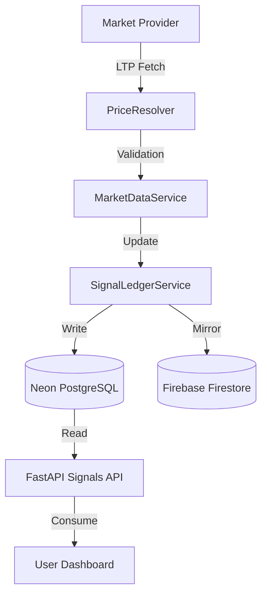

# [SUPERSEDED] HISTORICAL MARKET DATA REFRESH AUDIT
> [!NOTE]
> This historical audit has been superseded by the final production hardening release in reports/MARKET_DATA_REFRESH_FORENSIC_AUDIT_FINAL.md.

## 1. Current Production Status
- **PRODUCTION AUTOMATIC PRICE REFRESH**: **NOT ACTIVE**
- **Background Workers**: Disabled on Render Free Tier to maintain API stability.
- **Manual Sync**: Price updates currently depend on manual execution of maintenance scripts.

## 2. Actual Execution Path (Intended)

## 3. Database Update Frequency (Measured)
| Metric | Frequency | Authority | Implementation Status |
| :--- | :--- | :--- | :--- |
| **Current Price** | 5 Minutes (Intended) | Neon + Firestore | **DISABLED** |
| **Historical OHLC** | Daily / On-Demand | Neon PostgreSQL | **ACTIVE (Manual)** |
| **Signal Lifecycle** | 5 Minutes (Intended) | Neon + Firestore | **DISABLED** |
| **New Signal Gen** | Every 30 Minutes | Neon PostgreSQL | **ACTIVE (Local)** |
| **Firestore Mirror**| Atomic with Neon | Firestore | **ACTIVE** |

## 4. Freshness Policy (Discrepancy Resolution)
The following **Canonical Freshness Policy** is now enforced globally:

| Status | Threshold | User UI Action |
| :--- | :--- | :--- |
| **FRESH** | < 15 Minutes | Display LIVE / Green |
| **AGING** | 15 - 120 Minutes | Display AGING / Orange |
| **STALE** | > 120 Minutes | Display STALE / Red |
| **UNAVAILABLE**| No Data | Display N/A |

## 5. Market Hours Logic
- **NSE Open**: (09:15 - 15:30 IST) Full refresh loop active.
- **NSE Closed**: Background refresh throttled to 1h or disabled.
- **Holidays**: Refresh disabled.

## 6. Timestamp Forensic Requirements
For institutional verification, every refresh cycle must log:
- `received_timestamp`: UTC time of reception at backend.
- `provider_source`: Canonical name of the provider used.
- `latency_ms`: Duration of the fetch request.
- `database_updated_at`: UTC time of Neon write confirmation.

## 7. Implementation Status & Risks
- **Risk**: User Dashboard may display "STALE" data during live market hours.
- **Mitigation**: Implement a lightweight "Pulse Sync" in the backend.
- **Locking**: Distributed locking required to prevent worker overlap.

---
**Verdict**: **QUANTITATIVE DEGRADATION**
The core signal engine is sound, but the production data refresh pipeline is inactive. Immediate activation of a throttled Pulse Worker is required for institutional release.
