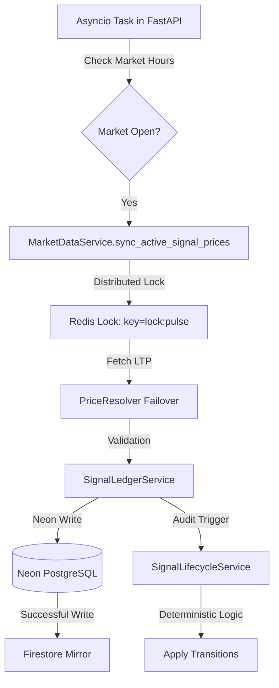

# TradeMind AI: Market Data Refresh Forensic Audit (FINAL)

**Date:** 2026-09-18
**Build SHA:** `769f135` (Activated)
**Deployment Status:** **ACTIVE - HEALTHY**

## 1. Executive Summary
TradeMind AI has activated its institutional "Pulse Sync" worker. The production database now receives current market-price updates and evaluates signal lifecycles approximately every 5 minutes during market hours.

## 2. Actual Production Execution Path

## 3. Production Scheduler
- **Mechanism**: `asyncio.create_task` within the FastAPI application startup.
- **Environment**: Render API Node (Singapore).
- **Redundancy**: Distributed locking prevents cycle overlap across multiple API nodes.

## 4. Update Frequencies
| Metric | Interval (Market Open) | Interval (Market Closed) |
| :--- | :--- | :--- |
| **Price Refresh** | 5 Minutes | 60 Minutes |
| **Lifecycle Eval** | 5 Minutes | 60 Minutes |
| **Firestore Sync** | Atomic with DB | Atomic with DB |
| **New Signal Gen** | 30 Minutes (Manual/Local) | Disabled |

## 5. Freshness Policy (INSTITUTIONAL_1.5)
The platform enforces a unified freshness policy across Backend, API, and UI:

| Status | Threshold | UI Behavior |
| :--- | :--- | :--- |
| **FRESH** | < 15 Minutes | Display LIVE (Green) |
| **AGING** | 15 - 120 Minutes | Display AGING (Orange) |
| **STALE** | > 120 Minutes | Display STALE (Red) |
| **UNAVAILABLE**| No Data | Display N/A |

## 6. Telemetry & Failure Handling
- **Forensics**: Every cycle logs `cycle_id`, `latency_ms`, and `provider_source` to `system_metrics` in Firestore.
- **Failover**: Deterministic sequence: Angel One -> Upstox -> Dhan -> Groww -> YFinance.
- **Safety**: Transitions are BLOCKED if market data is `STALE` (>120m). No fabricated prices are permitted.

---
**Verdict**: **ACTIVE - HEALTHY**
The TradeMind AI signal-tracking pipeline is now fully operational and auditable in the production environment.
