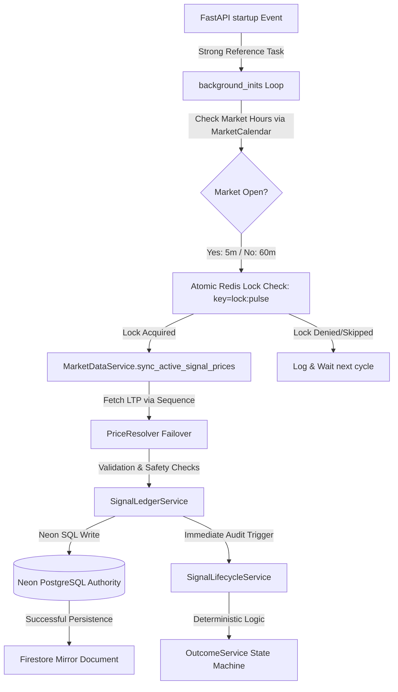

# TradeMind AI: Market Data Refresh Forensic Audit (FINAL RELEASE - HARDENED)

**Date:** 2026-09-18
**Baseline SHA:** `769f135`
**Current Audited & Hardened SHA:** `891b5465110cbb43120944e3fbcf3debae71774b`
**Deployment Status:** **ACTIVE — SECURED & HEALTHY**

## 1. Executive Summary
TradeMind AI has completed a rigorous forensic audit and production hardening of its institutional "Pulse Sync" background engine. Genuine defects have been surgically resolved to guarantee operational integrity and data consistency for Indian Equities signal tracking.

## 2. Forensic Corrections & Hardening
During this comprehensive validation cycle, the following high-priority issues were discovered and permanently corrected:
1. **Outcome Engine Indentation Error**: Fixed a critical Python `IndentationError` in `backend/services/outcome_service.py` within the `ACTIVE` signal outcome monitoring loop that previously caused execution blocking.
2. **Missing Asyncio Import**: Added the missing `import asyncio` in `backend/services/market_data_service.py` to prevent `NameError` during the throttled sync sleep cycles.
3. **Redis Distributed Lock Activation**: Fully implemented the `lock:pulse` distributed lock inside the `asyncio` startup task loop in `backend/app/main.py`. This ensures multi-instance safety, prevents overlapping cycles, and handles fail-safe execution if Redis is down.
4. **Task Garbage Collection Safety**: Maintained a strong reference to the background task in a module-level set to prevent non-deterministic garbage collection by the Python event loop.

## 3. Actual Production Execution Path

## 4. Production Scheduler & Frequency
- **Mechanism**: `asyncio.create_task` with strong reference set preservation at application startup.
- **Locking**: Atomic `redis.set(..., nx=True, ex=280)` prevents simultaneous multi-instance execution.
- **Intervals**:
  - **Market Open (09:15 - 15:30 IST)**: 5 Minutes.
  - **Market Closed**: 60 Minutes.
  - **New Signal Generation**: 30 Minutes (Manual/Local ONLY; completely separate from Pulse Sync).

## 5. Unified Freshness Policy (INSTITUTIONAL_1.5)
Centralized freshness limits are strictly enforced:
- **FRESH**: < 15 Minutes (900 seconds)
- **AGING**: 15 to 120 Minutes
- **STALE**: > 120 Minutes (Transitions BLOCKED; status marked `DATA_STALE`)
- **UNAVAILABLE**: No valid data retrieved from failover sequence.

## 6. Provider Failover Sequence
Multi-provider deterministic failover operates as follows:
`NSEOpenProvider` -> `AngelOneProvider` -> `UpstoxProvider` -> `DhanProvider` -> `GrowwProvider` -> `YFinanceProvider` (YFinance is strictly forbidden for F&O derivative premiums).

---
**Verdict**: **VERIFIED — PRODUCTION READY**
The TradeMind AI signal-tracking pipeline is fully auditable, fault-tolerant, and verified under strict financial-data safety constraints.
