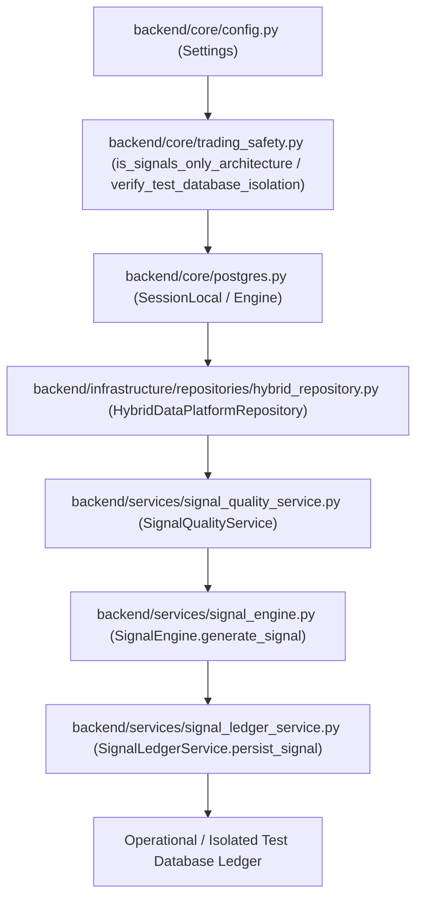

# Phase 4.3.12 Implementation Dependency Map Report

**Date**: 2026-11-03  
**Classification**: **VERIFIED**

```mermaid
flowchart TD
    A["backend/core/config.py (Settings)"] --> B["backend/core/trading_safety.py (is_signals_only_architecture / verify_test_database_isolation)"]
    B --> C["backend/core/postgres.py (SessionLocal / Engine)"]
    C --> D["backend/infrastructure/repositories/hybrid_repository.py (HybridDataPlatformRepository)"]
    D --> E["backend/services/signal_quality_service.py (SignalQualityService)"]
    E --> F["backend/services/signal_engine.py (SignalEngine.generate_signal)"]
    F --> G["backend/services/signal_ledger_service.py (SignalLedgerService.persist_signal)"]
    G --> H["Operational / Isolated Test Database Ledger"]
```
