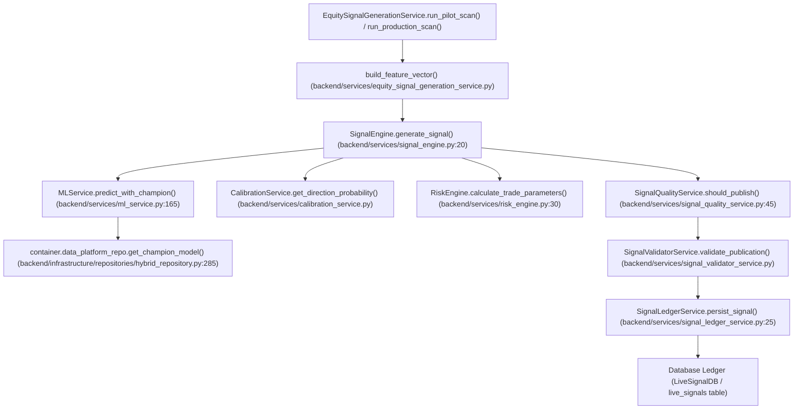

# Phase 4.3.17 Genuine Pipeline Call Graph Report

**Date**: 2026-11-03  
**Classification**: **VERIFIED**

```mermaid
flowchart TD
    A["EquitySignalGenerationService.run_pilot_scan() / run_production_scan()"] --> B["build_feature_vector() (backend/services/equity_signal_generation_service.py)"]
    B --> C["SignalEngine.generate_signal() (backend/services/signal_engine.py:20)"]
    C --> D["MLService.predict_with_champion() (backend/services/ml_service.py:165)"]
    D --> E["container.data_platform_repo.get_champion_model() (backend/infrastructure/repositories/hybrid_repository.py:285)"]
    C --> F["CalibrationService.get_direction_probability() (backend/services/calibration_service.py)"]
    C --> G["RiskEngine.calculate_trade_parameters() (backend/services/risk_engine.py:30)"]
    C --> H["SignalQualityService.should_publish() (backend/services/signal_quality_service.py:45)"]
    H --> I["SignalValidatorService.validate_publication() (backend/services/signal_validator_service.py)"]
    I --> J["SignalLedgerService.persist_signal() (backend/services/signal_ledger_service.py:25)"]
    J --> K["Database Ledger (LiveSignalDB / live_signals table)"]
```
